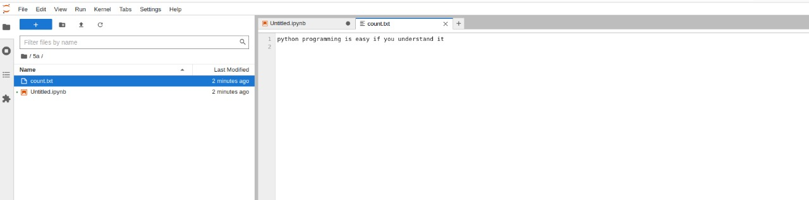

# Word-count
## AIM:
To write a python program for getting the word count from a text.
## EQUIPEMENT'S REQUIRED: 
PC
Anaconda - Python 3.7
## ALGORITHM: 
### Step 1:
Open visual studio code.

### Step 2:
Create file with .py extension.

### Step 3:
Start the program.

### Step 4:
Write the code.

### Step 5:
Run terminal for output of the given program.

### Step 6:
End the program.
## PROGRAM:
```python
#Developed by:MUKIL KUMAR V
#Register Number:22008798

num_words = 0 
with open('count.txt','r') as f1: 
    for i in f1:
        word = i.split() 
        num_words += len(word)
print("number of words in the file = {}".format(num_words))
```
### OUTPUT:
### (1)

### (2)

## RESULT:
Thus the program is written to find the word count from a text.
